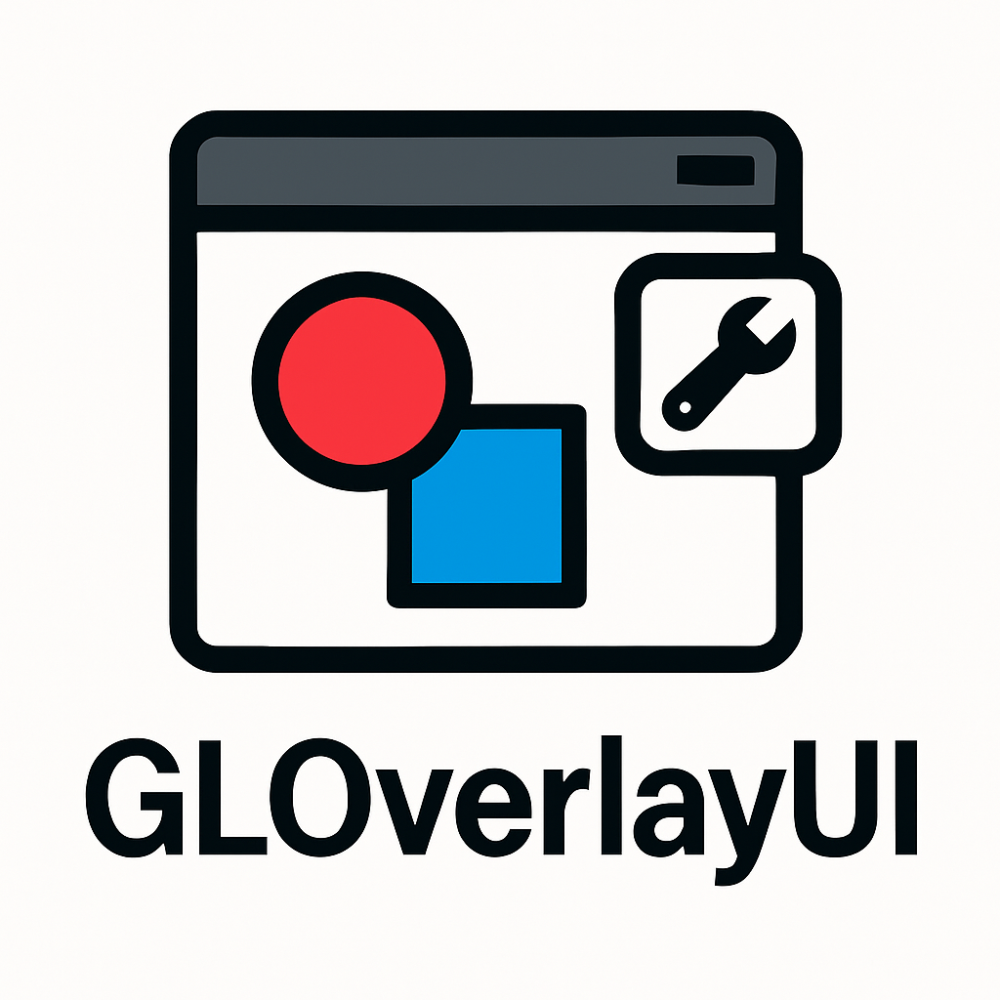

   


**GLOverlayUI** is a desktop application that demonstrates the integration of a real-time OpenGL rendering pipeline with a native wxWidgets GUI. It features an interactive 2D scene rendered on a `wxGLCanvas`, including a clickable OpenGL overlay and a dynamic control panel using native UI widgets.

---
## 🖼️ Features

- ✅ OpenGL-powered 2D scene rendered on `wxGLCanvas`
- 🎯 Clickable UI overlay (PNG icon) rendered directly in OpenGL
    - Using Mouse motion to control object  rotation 
- 📌 Toggleable right-side control panel with:
  - `wxSlider` to control object  scale 
    - `wxCheckBox` to toggle visibility of scene objects
    - 🧼 Clean separation between rendering engine and UI logic
    - 🔁 Real-time interaction between OpenGL scene and native UI


## 📁 Project Structure

```bash 

GLOverlayUI/
   ├── assets/              # Assets resources
   │   └── logo/            # Logo Emplacement folder
   │        └── <images>    # Images
   ├── src/                 # C++ source files
   │   ├── renderer.C       # OpenGL rendering logic (source) (UI-agnostic)
   │   ├── mainframe.C      # wxWidget  wrapper (source)
   │   ├── canvasdriver.C   # wxGLCanvas wrapper (source)
   ├── include/             # C++ header files
   │   ├── renderer.H       # OpenGL rendering logic (header) (UI-agnostic)
   │   ├── canvasdriver.H   # wxGLCanvas wrapper (header)
   │   ├── mainframe.H      # wxWidget wrapper (header)
   │   ├── GLOverlayUI_config.in.H     # Generated  Configuration (header)
   ├── CMakeLists.txt       # Build configuration
   ├── config/              # Folder  configuration
   │   └── GLOverlayUI_config.in   # Basic Config  of GLOverlayUI application
   ├── docs/                # Documentation folder
   │   ├── conf.py          # Sphinx configuration
   │   ├── index.rst        # This file (Sphinx entry point)
   │   ├── doc.cmake        # Doxygen + Sphinx integration
   │   ├── autodocs.cmake   # cmake file to automate the documentation build
   │   ├── make.bat         # Generated by sphinx-quickstart
   │   ├── Doxyfile         # Doxyfile Generated by Doxygen
   │   ├── Makefile         # Generated by sphinx-quickstart
   ├── GLOverlayUI_app.C    # Main application window and UI logic
   ├── requirements.txt     # Python dependencies for documentation
   └── README.md            # Project overview


```

##  Build Instructions (Linux)
 ✅ Prerequisites
 Ensure the following packages are installed: 
 >  cmake build-essential libwxgtk3.0-gtk3-dev libgl1-mesa-dev libglu1-mesa-dev

### Build the project
From the root of the repository:

```bash 
 cmake -B build
 cmake --build build
``` 

 *This will generate the GLOverlayUI executable inside the bin/ directory.*

 🚀 Run the Application
 ---
 
 > $ ./bin/GLOverlayUI 

###  Extra Build 

To build the complete application  with  the documentation: 
Make sure to enable the python environment : 

```bash 
$  python3 -m venv dist 
$  source dist/bin/activate 
$  python3 -m pip install -r /docs/requirements.txt # to install  dependencies  
```
Once done , you can proceed  with the classical cmake build  above: 
it'll compile all the sources + docs 


 📦 Dependencies
 ---
 * wxWidgets (GUI framework)
 * OpenGL (GL/GLU for 2D rendering)
 * CMake ≥ 3.11 

 PNG loading is handled via wxImage (no external image libraries required).

 🏛️ Architecture Overview
 ---
 The application is organized into three decoupled components:

 Component    Description Depends on wxWidgets
 renderer     Core OpenGL rendering logic ❌
 canvasdriver wxGLCanvas wrapper, handles UI integration  ✅
 MainFrame    Main UI (panel, slider, checkbox)   ✅

 This separation enables easy testing and reusability of the rendering logic in other contexts.

 📸 Screenshots
 ---
 ([]Todo  Add a screenshot here showing the scene + overlay + control panel)

 📄 License
 This project is released under the GPLv3 License. See LICENSE for details.

 🙋‍♂️ Author
 ---
 Made with ❤️  by  Umar Ba <jUmarB@protonmail.com> 
