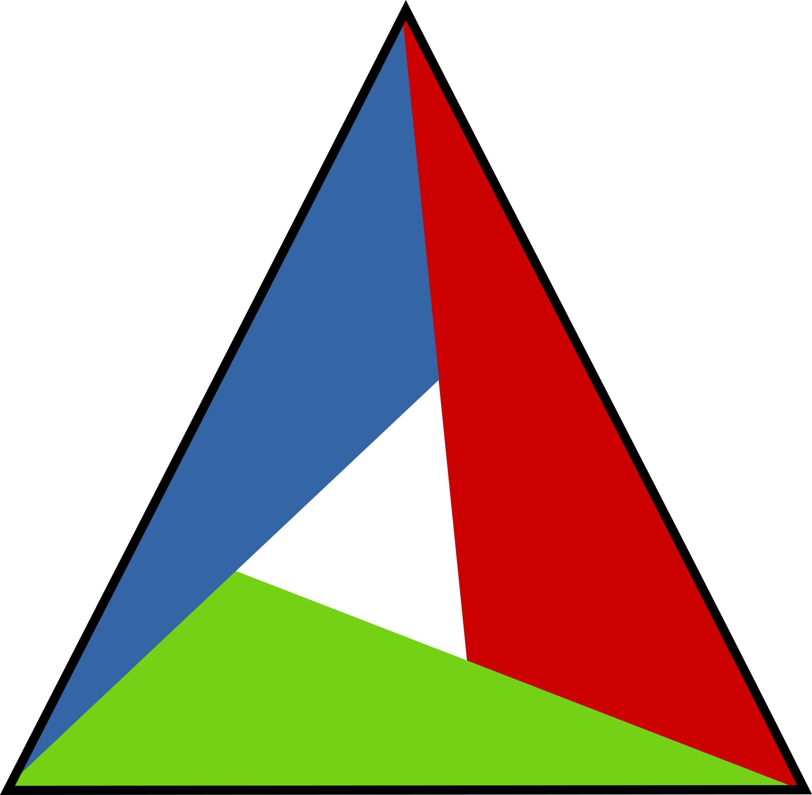

***************************
Acknowledgments & Resources
***************************

.. toctree:: 
   :maxdepth: 4 
   :caption: Contents:

Acknowledgments
===============

This project, **GLOverlayUI**, has been made possible thanks to the combined power of: 

.. image::  ../_static/logos/wxWidget.png 
   :width: 200 px
   :height: 200 px

- **OpenGL**: for real-time rendering
- **wxWidgets**: for the native cross-platform GUI framework
- **CMake**: for providing a clean and extensible build system

We gratefully acknowledge these technologies as the foundation of this software.

Awesomes Resources
------------------

The following resources have been invaluable in the learning and development process:

**Learning Tutorials**

- `Hello World Demo <https://docs.wxwidgets.org/latest/overview_helloworld.html>`__
- `ZetCode wxWidgets Tutorial <https://zetcode.com/gui/wxwidgets/>`__
- `Computer Graphics Notes <https://jonshiach.github.io/graphics-notes/intro.html>`__

**Essential Documentation**

- `wxWidgets Official Docs <https://docs.wxwidgets.org>`__
- `OpenGL Official Docs <https://docs.gl>`__
- `Learn OpenGL <https://learnopengl.com>`__
 
---

With sincere thanks to the open-source community and the authors of these amazing tutorials and documentation.
Without them, **GLOverlayUI** would not have reached this level of accomplishment.
